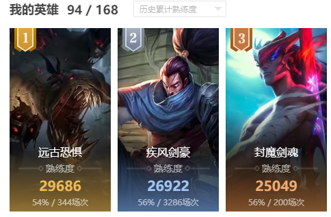

[![header]][home]

[![moe-counter]][home]

<h1 align="center">你好！我是WJZ_P！ 👋</h1>

  

<h2 align="center">"你我狂想畅谈间，将所愿世界构建。"</h2>
 

  

<h2 align="left">我目前使用的语言和框架:</h2>

  
 
 
 
 
 

>

>

>

>
>

>

>

>

## [个人介绍（点击查看主页）](https://github.com/WJZ-P)

### 爱好

- ### 喜欢玩游戏，平时玩LOL比较多，联盟二区。主玩亚索永恩和稻草人。单双最高翡翠I，灵活最高钻I

  

- ### 喜欢写代码。下面是我维护的三个主要项目
    - ### [LiteLoaderQQNT-Encrypt-Chat](https://github.com/WJZ-P/LiteLoaderQQNT-Encrypt-Chat)
    - ### [LiteLoaderQQNT-Change-Summary](https://github.com/WJZ-P/LiteLoaderQQNT-Encrypt-Chat)
    - ### [LiteLoaderQQNT-Echo-Message](https://github.com/WJZ-P/LiteLoaderQQNT-Echo-Message)

### 博客
- #### 暂时没有

### 技术栈
- #### 平时写作业用C++
- #### 写QQ机器人用Python，以前用CQhttp框架，ntqq出来之后转LLOneBot
- #### 写NTQQ插件用js，就上面的三个项目
- #### 实训的时候用Vue写的网页，Vue也会一点
- #### React也略微了解过，写过一个简单的React+Electron小东西，可以秒选LOL英雄
- #### Java主要是以前学MC fabric mod的编写的时候用，了解得不多

[home]: https://github.com/WJZ-P
[header]: https://capsule-render.vercel.app/api?type=Waving&color=timeGradient&height=140&text=WJZ_P&fontSize=45&fontFamily=sans&textColor=%23FFFFFF&border=5px%20solid%20%23000000&borderRadius=20&shadow=0px%200px%2010px%20rgba(0,0,0,0.5)
[moe-counter]: https://count.getloli.com/get/@WJZ-P?theme=rule34

